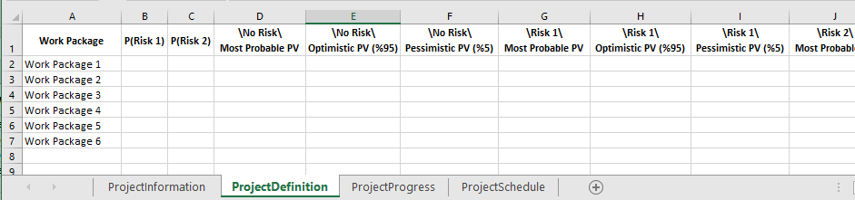
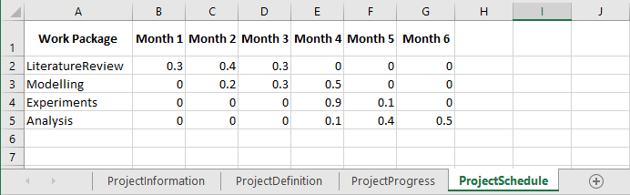

# PROPCOT
PRObabilistic Project COntrol Tool

## Requirements
PROPCOT is a Python 3 script. PyMC3, pandas and numpy packages are required. 

## Running the Tool
In order to run PPCT:
1. Extract “PPCT.zip” to a folder.
2. Fill out “ModelSettings.xlsx” with the information of the project that will be controlled. Settings file is explained further below.
3. Run “EVM_Model_Run.py”.

## Model Settings
Model settings spreadsheet consist of four tabs, namely ‘project information’, ‘project definition’, ‘project progress’, and ‘project schedule’. The tool will obtain enough information to build and calculate the project control Bayesian network (BN) with risk factors using information, observations, and probabilities entered into these four tabs. The ‘project information’ tab contains general information such as project name and the project control moment. Next three tabs contain data regarding different parts of the BN. Combining these tabs, the tool runs the full BN. The BN model is based on the project control method Earned Value Management (EVM).

## Project Information
User will enter project name and project control moment to the project information tab. Entering the project control moment correctly is important for accurate calculations of EVM parameters and workload distribution. This value represents which of the time periods (month, week, day, etc.) the project control takes place. The value should be consistent with the time period values that will be entered into project schedule tab. Figure 1 shows an example of project information interface.

*Figure 1 Project Information Tab*

## Project Definition
Project Definition Interface
In the project definition tab, user will define all the work packages (activities) in the project as a new row and fill out the probabilities of risk factors happening (up to two). Following risk factor probabilities, planned value (PV) of each activity will be entered. Unlike the current EVM approaches in the literature that take PVs of activities as a single point value, developed PPCT defines a probability distribution to PVs of activities, thus, user is expected to enter ‘most probable’, ‘optimistic’, and ‘pessimistic’ PVs for each activity. The tool then calculates the relevant probability distributions and parameters using this triangle of values. User will enter the PV values for the scenarios in which neither risk factor happens, only each of the risk factors happens separately, and both risk factors happen together, respectively. If there is less than two risk factors for a certain activity, relevant PV parts can be left blank. Figure 2 shows an empty example of project definition tab; Figure 3 is a filled out example of the interface.

*Figure 2 Project Definition Tab*

*Figure 3 Project Definition Tab Example*

## Project Progress
Project progress tab takes values regarding the current state of the project. The activity completion (%) values in this tab are also used to estimate a probability distribution similar to PVs in the project definition tab. Instead of a single point value of completion percentage of an activity, user will enter the expected completion value as well as lower and upper limits of possible completion. If the user is actually certain about the completion percentage, lower and upper limits can be left blank so the tool will treat it as a single point value. In case only upper limit is left blank, the tool will assume it is 1, similarly if only lower limit is left blank, the tool will assume it is 0. These completion values will be used together with PVs calculate earned values (EV) of activities by PPCT.
Additionally, in this tab user will enter actual costs (AC) of activities up to the project control moment. As these are actual observations of costs that already occurred in the project duration up to the control moment, these are entered as single point values. An empty project progress tab is given in Figure 4; an example is given in Figure 5.

*Figure 4 Project Progress Tab*

*Figure 5 Project Progress Tab Example*

## Project Schedule
Project schedule tab is used to define the project duration (PD) as well as the distribution of planned workload for each time period. The tool will use these values to calculate partial PVs up to the project control (using the project control moment value in project information tab) to estimate performance indices. Using the planned workloads and partial PVs, tool will be able to assist evaluating whether activities are behind or ahead of the schedule. It might also be used to deduce whether the workload for the remaining parts of the project needs to be reconsidered. Figure 6 shows an empty project schedule tab; Figure 7 is a filled out example.

*Figure 6 Project Scedule Tab*

*Figure 7 Project Schedule Tab Example*

